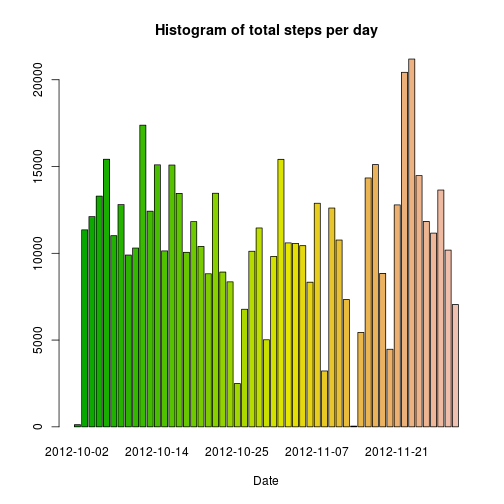
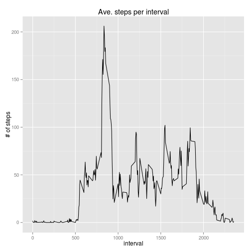
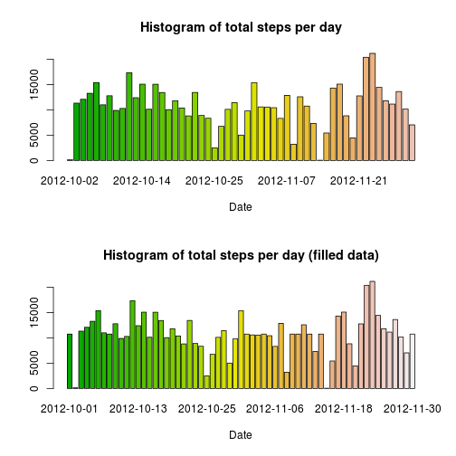

# Reproducible Research: Peer Assessment 1
This is a report on the activity based from anonymous user that share their stats from different mobile enabled devices.
Those devices track different information about the user. Some examples of those tools are: Fitbit, Nike Fuelband, or Jawbone Up. 


## Loading and preprocessing the data
The assumption is that data reside in current working directory. First step of process is to load the data into a dataframe
in this case called *activity*.

```r
activity<-read.csv("activity.csv")
```

In second step will be to get first feeling of data by calling ```summary(activity)```.


```r
library(xtable)
xt<-xtable(summary(activity))
print(xt, type="html")
```

<!-- html table generated in R 3.1.0 by xtable 1.7-3 package -->
<!-- Sun Jun 15 06:48:57 2014 -->
<TABLE border=1>
<TR> <TH>  </TH> <TH>     steps </TH> <TH>         date </TH> <TH>    interval </TH>  </TR>
  <TR> <TD align="right"> 1 </TD> <TD> Min.   :  0.0   </TD> <TD> 2012-10-01:  288   </TD> <TD> Min.   :   0   </TD> </TR>
  <TR> <TD align="right"> 2 </TD> <TD> 1st Qu.:  0.0   </TD> <TD> 2012-10-02:  288   </TD> <TD> 1st Qu.: 589   </TD> </TR>
  <TR> <TD align="right"> 3 </TD> <TD> Median :  0.0   </TD> <TD> 2012-10-03:  288   </TD> <TD> Median :1178   </TD> </TR>
  <TR> <TD align="right"> 4 </TD> <TD> Mean   : 37.4   </TD> <TD> 2012-10-04:  288   </TD> <TD> Mean   :1178   </TD> </TR>
  <TR> <TD align="right"> 5 </TD> <TD> 3rd Qu.: 12.0   </TD> <TD> 2012-10-05:  288   </TD> <TD> 3rd Qu.:1766   </TD> </TR>
  <TR> <TD align="right"> 6 </TD> <TD> Max.   :806.0   </TD> <TD> 2012-10-06:  288   </TD> <TD> Max.   :2355   </TD> </TR>
  <TR> <TD align="right"> 7 </TD> <TD> NA's   :2304   </TD> <TD> (Other)   :15840   </TD> <TD>  </TD> </TR>
   </TABLE>

## What is mean total number of steps taken per day?

```r
groupedBy<-aggregate(steps ~ date, activity, sum)
```
Histogram of total steps per day

```r
barplot(groupedBy[,"steps"], names.arg=groupedBy[,"date"], main="Histogram of total steps per day", xlab="Date", col=terrain.colors(61))
```

 

Let's aggregate data to information per day:

```r
mean(groupedBy[,"steps"], na.rm=TRUE)
```

```
## [1] 10766
```

```r
median(groupedBy[,"steps"], na.rm=TRUE)
```

```
## [1] 10765
```


## What is the average daily activity pattern?
Make a time series plot (i.e. type = "l") of the 5-minute interval (x-axis) and the average number of steps taken, averaged across all days (y-axis)   

Let's take an agregate per interval

```r
dailyIntervals<-aggregate(steps~interval, activity, mean)
library(ggplot2)
ggplot(dailyIntervals, aes(interval, steps)) + geom_line() + xlab("interval") + ylab("# of steps")+ggtitle("Ave. steps per interval")
```

 

Which 5-minute interval, on average across all the days in the dataset, contains the maximum number of steps?

```r
dailyIntervals[dailyIntervals[,"steps"]==max(dailyIntervals[,"steps"]),"interval"]
```

```
## [1] 835
```

## Imputing missing values

*Note that there are a number of days/intervals where there are missing values (coded as NA). The presence of missing days may introduce bias into some calculations or summaries of the data.*

*Calculate and report the total number of missing values in the dataset (i.e. the total number of rows with NAs)*

To calculate total number of missing values a `comple.cases` function will be used. This function will create a vector of `TRUE` and `FALSE` values that we can use to calculate total number of missing values. From the first step (`summary`) we know that only steps have missing values. Therefore this approach will give us total number of missing values (just by taking subvector of `FALSE` values and getting the length of vector).


```r
completeActivity<-complete.cases(activity)
length(completeActivity[completeActivity==FALSE])
```

```
## [1] 2304
```

*Devise a strategy for filling in all of the missing values in the dataset. The strategy does not need to be sophisticated. For example, you could use the mean/median for that day, or the mean for that 5-minute interval, etc.*

*Create a new dataset that is equal to the original dataset but with the missing data filled in.*


To fill the `NA` values we are going to use a mean for interval from `dailyIntervals` to fill in missing values. Procedure will consist of the following steps:

1. copy `activity` dataframe to a new data frame called `filledActivity`
1. iteratate through every row of the data frame
1. if value of staps is `NA` value then proceed to next step, else go to next row
1. create regular expression based on interval to get string we look for in lookup table (`dailyIntervals`). Surrounding interval with `^`, `$` allows for getting exactly one value (otherwise having interval `0` we get multiple hits in grep)
1. find position in `dailyInterval` of given interval
1. substitute value of `dailyInterval$steps` based on position in the `filledActivity` row


```r
filledActivity <- activity

for (i in 1:length(activity$interval)) {
  if (is.na(filledActivity[i, "steps"])) {
    strToLookFor=paste(c('^',filledActivity[i,"interval"],'$'), collapse='');
    posInDailyIntervals<-grep(strToLookFor, dailyIntervals[,"interval"]);
    filledActivity[i,"steps"]<-dailyIntervals[posInDailyIntervals, "steps"];
  }
}
```

To check this loop with lookup we can call summary on both dataframes. 


```r
xt<-xtable(summary(activity))
print(xt, type="html")
```

<!-- html table generated in R 3.1.0 by xtable 1.7-3 package -->
<!-- Sun Jun 15 06:49:01 2014 -->
<TABLE border=1>
<TR> <TH>  </TH> <TH>     steps </TH> <TH>         date </TH> <TH>    interval </TH>  </TR>
  <TR> <TD align="right"> 1 </TD> <TD> Min.   :  0.0   </TD> <TD> 2012-10-01:  288   </TD> <TD> Min.   :   0   </TD> </TR>
  <TR> <TD align="right"> 2 </TD> <TD> 1st Qu.:  0.0   </TD> <TD> 2012-10-02:  288   </TD> <TD> 1st Qu.: 589   </TD> </TR>
  <TR> <TD align="right"> 3 </TD> <TD> Median :  0.0   </TD> <TD> 2012-10-03:  288   </TD> <TD> Median :1178   </TD> </TR>
  <TR> <TD align="right"> 4 </TD> <TD> Mean   : 37.4   </TD> <TD> 2012-10-04:  288   </TD> <TD> Mean   :1178   </TD> </TR>
  <TR> <TD align="right"> 5 </TD> <TD> 3rd Qu.: 12.0   </TD> <TD> 2012-10-05:  288   </TD> <TD> 3rd Qu.:1766   </TD> </TR>
  <TR> <TD align="right"> 6 </TD> <TD> Max.   :806.0   </TD> <TD> 2012-10-06:  288   </TD> <TD> Max.   :2355   </TD> </TR>
  <TR> <TD align="right"> 7 </TD> <TD> NA's   :2304   </TD> <TD> (Other)   :15840   </TD> <TD>  </TD> </TR>
   </TABLE>

In case of `filledActivity` there is no missing values (7th line from `activity`).


```r
xt<-xtable(summary(filledActivity))
print(xt, type="html")
```

<!-- html table generated in R 3.1.0 by xtable 1.7-3 package -->
<!-- Sun Jun 15 06:49:01 2014 -->
<TABLE border=1>
<TR> <TH>  </TH> <TH>     steps </TH> <TH>         date </TH> <TH>    interval </TH>  </TR>
  <TR> <TD align="right"> 1 </TD> <TD> Min.   :  0.0   </TD> <TD> 2012-10-01:  288   </TD> <TD> Min.   :   0   </TD> </TR>
  <TR> <TD align="right"> 2 </TD> <TD> 1st Qu.:  0.0   </TD> <TD> 2012-10-02:  288   </TD> <TD> 1st Qu.: 589   </TD> </TR>
  <TR> <TD align="right"> 3 </TD> <TD> Median :  0.0   </TD> <TD> 2012-10-03:  288   </TD> <TD> Median :1178   </TD> </TR>
  <TR> <TD align="right"> 4 </TD> <TD> Mean   : 37.4   </TD> <TD> 2012-10-04:  288   </TD> <TD> Mean   :1178   </TD> </TR>
  <TR> <TD align="right"> 5 </TD> <TD> 3rd Qu.: 27.0   </TD> <TD> 2012-10-05:  288   </TD> <TD> 3rd Qu.:1766   </TD> </TR>
  <TR> <TD align="right"> 6 </TD> <TD> Max.   :806.0   </TD> <TD> 2012-10-06:  288   </TD> <TD> Max.   :2355   </TD> </TR>
  <TR> <TD align="right"> 7 </TD> <TD>  </TD> <TD> (Other)   :15840   </TD> <TD>  </TD> </TR>
   </TABLE>

*Make a histogram of the total number of steps taken each day and Calculate and report the mean and median total number of steps taken per day. Do these values differ from the estimates from the first part of the assignment? What is the impact of imputing missing data on the estimates of the total daily number of steps?*


```r
totalsForFilledActivity<-aggregate(steps ~ date, filledActivity, sum)

par(mfrow = c(2, 1));
barplot(groupedBy[,"steps"], names.arg=groupedBy[,"date"], main="Histogram of total steps per day", xlab="Date", col=terrain.colors(61));
barplot(totalsForFilledActivity[,"steps"], names.arg=totalsForFilledActivity[,"date"], main="Histogram of total steps per day (filled data)", xlab="Date", col=terrain.colors(61));
```

 

Differences are easily visible, for example Oct. 1st, 2012 gains values as opposed to original data. Also whole days are smoother then before.

Let's agregate data to information per day

```r
mean(totalsForFilledActivity[,"steps"], na.rm=TRUE)
```

```
## [1] 10766
```

```r
median(totalsForFilledActivity[,"steps"], na.rm=TRUE)
```

```
## [1] 10766
```


## Are there differences in activity patterns between weekdays and weekends?


*For this part the weekdays() function may be of some help here. Use the dataset with the filled-in missing values for this part.*
*Create a new factor variable in the dataset with two levels – “weekday” and “weekend” indicating whether a given date is a weekday or weekend day.*


```r
library(lubridate); 
filledActivity$weekdays<-weekdays(ymd(filledActivity$date));
filledActivity$weekdays["Monday"==filledActivity$weekdays]<-"weekday";
filledActivity$weekdays["Tuesday"==filledActivity$weekdays]<-"weekday";
filledActivity$weekdays["Wednesday"==filledActivity$weekdays]<-"weekday";
filledActivity$weekdays["Thursday"==filledActivity$weekdays]<-"weekday";
filledActivity$weekdays["Friday"==filledActivity$weekdays]<-"weekday";
filledActivity$weekdays["Saturday"==filledActivity$weekdays]<-"weekend";
filledActivity$weekdays["Sunday"==filledActivity$weekdays]<-"weekend";
filledActivity$weekdays<-as.factor(filledActivity$weekdays);
```


Make a panel plot containing a time series plot (i.e. type = "l") of the 5-minute interval (x-axis) and the average number of steps taken, averaged across all weekday days or weekend days (y-axis). The plot should look something like the following, which was creating using simulated data:


```r
meanForFilledActivity<-aggregate(steps ~ interval+weekdays, filledActivity, mean)

par(mfrow=c(2,1))
plot(x=meanForFilledActivity$interval[meanForFilledActivity$weekdays=="weekday"], 
     y=meanForFilledActivity$steps[meanForFilledActivity$weekdays=="weekday"], 
     type="l", xlab="", ylab="", main="Weekday")
plot(x=meanForFilledActivity$interval[meanForFilledActivity$weekdays=="weekend"], 
     y=meanForFilledActivity$steps[meanForFilledActivity$weekdays=="weekend"], 
     type="l", xlab="", ylab="", main="Weekend")
```

 
